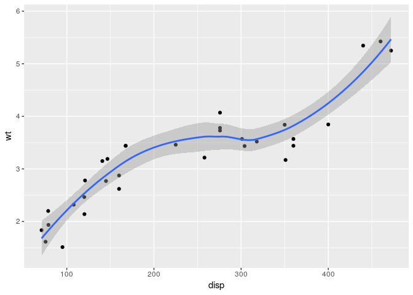
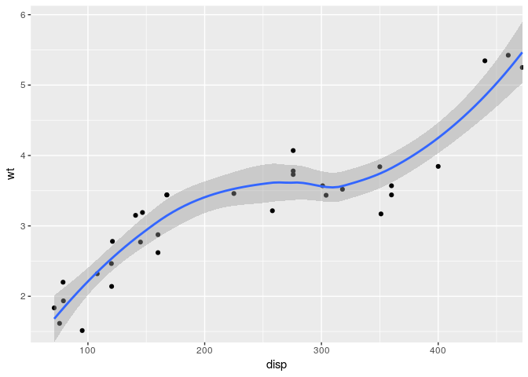

-   [Comma format - Indian style](#comma-format---indian-style)
-   [Convert output of 'glimpse' function to org-mode's table format](#convert-output-of-glimpse-function-to-org-modes-table-format)
-   [Calendar heatmap](#calendar-heatmap)
-   [Get the list of star-ed repos and corresponding info](#get-the-list-of-star-ed-repos-and-corresponding-info)
-   [Selective usage of `expand` parameter in `ggplot2::coord_cartesian`](#selective-usage-of-expand-parameter-in-ggplot2coord_cartesian)

<!-- README.md is generated from README.Rmd. Please edit that file -->
This repo contains custom R functions/scripts that I find useful. Each file/script is self-contained. You are free to copy as you wish, under the MIT License.

Comma format - Indian style
===========================

``` r
source('indian_style_comma_formatter.R')
indian_comma(c(0, 10, 8, 1000, 234, 500007, 12315414))
#> [1] "0"           "10"          "8"           "1,000"       "234"        
#> [6] "5,00,007"    "1,23,15,414"
```

Convert output of 'glimpse' function to org-mode's table format
===============================================================

``` r
source('glimpse_output_as_org_table.R')
#> 
#> Attaching package: 'dplyr'
#> The following objects are masked from 'package:stats':
#> 
#>     filter, lag
#> The following objects are masked from 'package:base':
#> 
#>     intersect, setdiff, setequal, union
glimpse_output_as_org_table(as.data.frame(cars))
#> Observations: 50
#> Variables: 2
#> |  speed |<dbl>| 4, 4, 7, 7, 8, 9, 10, 10, 10, 11, 11, 12, 12, 12, 12, 13... |
#> |  dist  |<dbl>| 2, 10, 4, 22, 16, 10, 18, 26, 34, 17, 28, 14, 20, 24, 28... |
```

Calendar heatmap
================

``` r
source('calendar_heatmap.R')
#> 
#> Attaching package: 'lubridate'
#> The following object is masked from 'package:base':
#> 
#>     date
#> Loading required package: viridisLite
df <- data.frame(timestamp = as.POSIXct('2017-01-01') + ((0:364)*86400), value = rnorm(365))
calendar_heat_map(df, 'timestamp', 'value')
```


Get the list of star-ed repos and corresponding info
====================================================

``` r
source('get_github_stars.R')
#> Loading required package: xml2
get_github_stars_data('https://github.com/sainathadapa?tab=stars') %>% glimpse
#> Observations: 187
#> Variables: 7
#> $ name        <chr> "szilard/GBM-multicore", "nstrayer/shinysense", "m...
#> $ description <chr> "GBM multicore scaling: h2o, xgboost and lightgbm ...
#> $ language    <chr> "HTML", "JavaScript", "Python", "R", "R", "Jupyter...
#> $ stars       <chr> "5", "27", "202", "51", "1", "176", NA, "27", "309...
#> $ forks       <chr> NA, "3", "15", "5", NA, "20", "231", "7", "34", "2...
#> $ updated     <chr> "Jun 27, 2017", "Jun 28, 2017", "Jun 30, 2017", "J...
#> $ url         <chr> "https://github.com/szilard/GBM-multicore", "https...
```
Update (2017-07-17): Seems like there is an easier way to get this data. Goto `https://api.github.com/users/<username>/starred`.

Selective usage of `expand` parameter in `ggplot2::coord_cartesian`
===================================================================

For more information, see <https://github.com/tidyverse/ggplot2/pull/1697>.

``` r
library(ggplot2)
p <- ggplot(mtcars, aes(disp, wt)) + geom_point() + geom_smooth()
print(p)
#> `geom_smooth()` using method = 'loess'
```



``` r
source('coord-cartesian-modified.R')
p + coord_cartesian_sp(expand = c(T, F, F, T))
#> `geom_smooth()` using method = 'loess'
```



Notice that the expansion factor was applied to the left and top edges of the plot, but not to the other edges.
