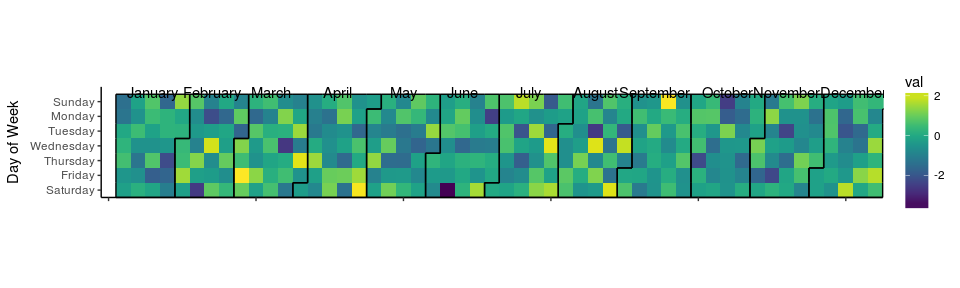

-   [Comma format - Indian style](#comma-format---indian-style)
-   [Convert output of 'glimpse' function to org-mode's table format](#convert-output-of-glimpse-function-to-org-modes-table-format)
-   [Calendar heatmap](#calendar-heatmap)
-   [Get data about the repos that I star-ed in Github](#get-data-about-the-repos-that-i-star-ed-in-github)

<!-- README.md is generated from README.Rmd. Please edit that file -->
This repo contains custom R functions/scripts that I find useful. Each file/script is self-contained. You are free to copy as you wish, under the MIT License.

Comma format - Indian style
===========================

``` r
source('indian_style_comma_formatter.R')
indian_comma(c(0, 10, 8, 1000, 234, 500007, 12315414))
#> [1] "0"           "10"          "8"           "1,000"       "234"        
#> [6] "5,00,007"    "1,23,15,414"
```

Convert output of 'glimpse' function to org-mode's table format
===============================================================

``` r
source('glimpse_output_as_org_table.R')
#> 
#> Attaching package: 'dplyr'
#> The following objects are masked from 'package:stats':
#> 
#>     filter, lag
#> The following objects are masked from 'package:base':
#> 
#>     intersect, setdiff, setequal, union
glimpse_output_as_org_table(as.data.frame(cars))
#> Observations: 50
#> Variables: 2
#> |  speed |<dbl>| 4, 4, 7, 7, 8, 9, 10, 10, 10, 11, 11, 12, 12, 12, 12, 13... |
#> |  dist  |<dbl>| 2, 10, 4, 22, 16, 10, 18, 26, 34, 17, 28, 14, 20, 24, 28... |
```

Calendar heatmap
================

``` r
source('calendar_heatmap.R')
#> 
#> Attaching package: 'lubridate'
#> The following object is masked from 'package:base':
#> 
#>     date
#> Loading required package: viridisLite
df <- data.frame(timestamp = as.POSIXct('2017-01-01') + ((0:364)*86400), value = rnorm(365))
calendar_heat_map(df, 'timestamp', 'value')
```



Get data about the repos that I star-ed in Github
=================================================

``` r
source('get_github_stars.R')
#> Loading required package: xml2
get_github_stars_data('https://github.com/sainathadapa?tab=stars') %>% glimpse
#> Observations: 172
#> Variables: 6
#> $ name        <chr> "rstudio/keras", "lockedata/pRojects", "Dpananos/G...
#> $ description <chr> "R Interface to Keras", "R package for making proj...
#> $ language    <chr> "R", "R", "Jupyter Notebook", "Jupyter Notebook", ...
#> $ stars       <chr> "80", "36", "48", "1,220", "490", "27", "2,971", "...
#> $ forks       <chr> "7", "3", "10", "541", "33", "3", "141", NA, "250"...
#> $ updated     <chr> "Jun 6, 2017", "May 13, 2017", "Jun 4, 2017", "Jun...
```
